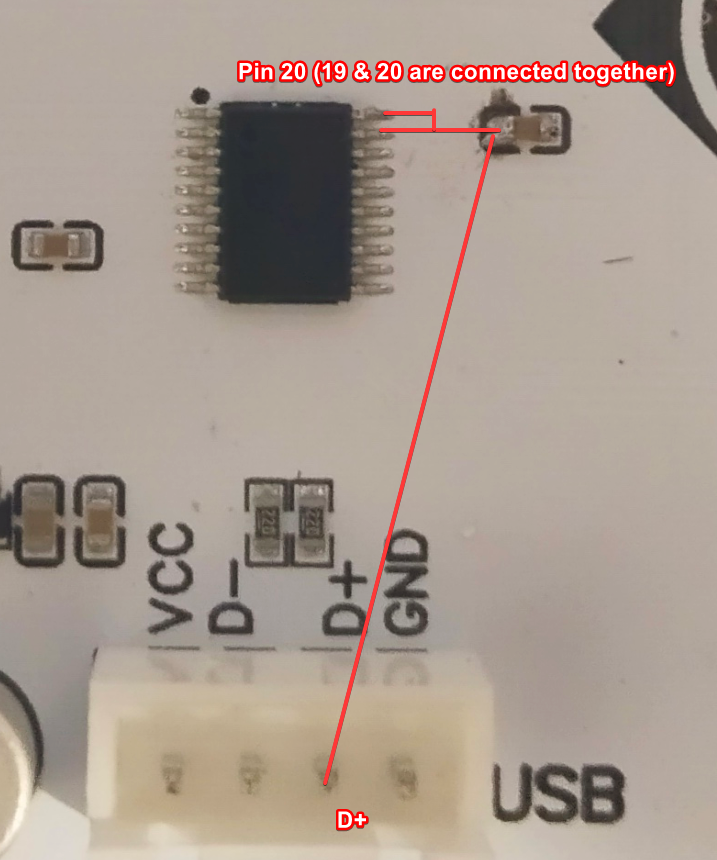
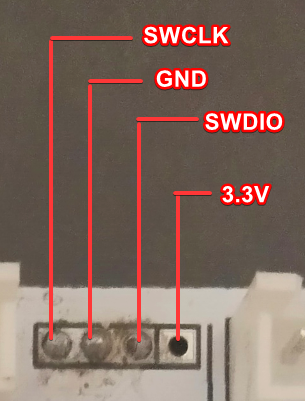

# Yuangeki-PCB-Research

This repo serves to document the yuangeki PCB as much as possible. It contains the following.

- Rough Schematic of the Yuangeki PCB V1.2a*
- PoC custom firmware you can flash on the board (More details below)
- Firmware dumps**

The goal of this repo is to document my findings in hopes someone more capable than me can make a more stable firmware.

I made the PoC firmware to fix an issue with the lever & implementing a more proper IO implementation other than Mouse + KB

*I really meant rough. I did my best to double check the connections but I can't guarantee everything is accurate. There's also pictures of the PCB with annotations of what I think is relevant. Capacitor values are unknown and I have no way of measuring them.

**I couldn't dump the firmware of the CH552T and I have already overwritten the firmware.

Findings
---

The Yuangeki PCB uses an `STM32G030C8` paired with a `CH552T` as the STM32 used here has no native USB peripheral. Both chips communicate using UART.

<sub>There's possibly more things I can say here but I can't remember what at the moment.</sub>


PoC Firmware Features
---

- MU3IO.NET Support
- WebUI to configure LEDs and update the STM32 as well as to reboot the CH552T into bootloader mode.

How to flash the firmware
---
> [!WARNING]
>
> The code was fully written by an AI Agent. Therefore I cannot guarantee everything will work.
>
> By flashing this firmware you agree that you are doing this at your own risk and I am not held liable for any broken/bricked boards.

What you'll need:
- 1K ohm resistor
- STLink or an alternate way of flashing the STM32.
- Reading ability and patience
- A copy of this repo
- STM32CubeProgrammer
- [wchisp](https://github.com/ch32-rs/wchisp)

<sub>Commands run in the guide assumes you are in the root of the repo.</sub>

**Flashing the CH552T**
1. Jump the D+ Pin and Pin 20 of the CH552T then plug in the USB cable.



2. You only have a small window of time to do this. After plugging it in run
```sh
wchisp -u flash "./yuantgeki-ch552.bin"
```
3. Assuming it doesn't error out. Congratz you flashed the CH552T. You can remove the resistor and proceed.

**Flashing the STM32**

<sub>This will assume you have an STLink</sub>

1. Plug in your STLink according to the pinout of the header



2. Plug the STLink into your computer and run:
```sh
STM32_Programmer_CLI -c port=SWD -d ".\yuantgeki-stm32.hex" -v -rst
```

3. You should be done and the firmware is fully flashed!

Web Interface
---

The web interface can be run using

```sh
 python -m http.server 4173 --directory ./src/web/dist
 ```

 And can be accessed through a Chrome based browser

<sub>It communicates using WebHID</sub>

Using MU3IO.NET
---
Go to [jujuforce's MU3IO fork](https://github.com/jujuforce/Mu3IO.NET/releases/) and follow the instructions there.

The PoC firmware is recognized as a Ontroller as it uses the Ontroller's VID/PIDs.

Known Issues
---

- Flashing the STM32 from the WebUI needs multiple retries until it actually reboots into bootloader mode.
- Settings saving is not reliable, also requiring multiple tries to save until it works.
- MU3IO.NET Lighting is not implemented. I ran into issues getting lighting to work correctly and due to time constraints, I gutted the lighting and just let the reactive lighting take over instead.
